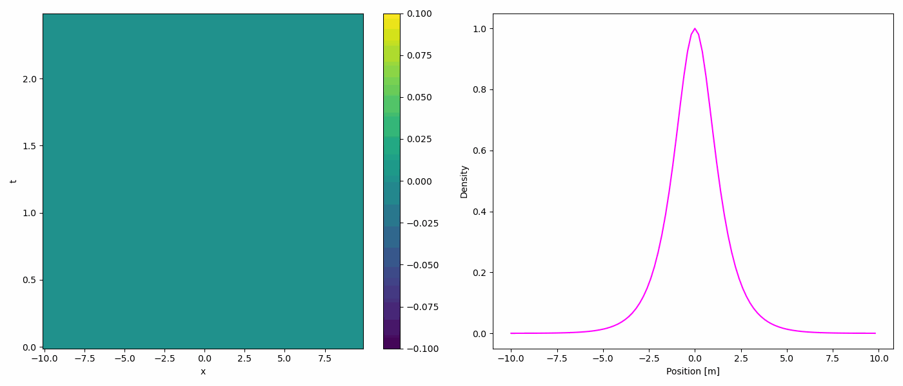

# Computational Fluid Dynamics

This repository contains computational fluid dynamics (CFD) works undertaken as part of the Computational Physics II lectures at Yachay Tech University. The materials cover various topics in CFD, including discretization, meshing, conservation principles, advection, shocks, and an introduction to hydrodynamics.

## Examples

### 1D Wave Simulation

This GIF shows the animation of a 1-dimensional wave solved using the Fast Fourier Transform (FFT) method.

## Contents

- **Discretization and Meshing**: Learn about the discretization techniques used in CFD, including finite difference, finite volume, and finite element methods. Understand the importance of meshing in accurately representing the geometry and flow domain.

- **Conservation Principles**: Explore the fundamental principles of conservation in fluid dynamics, including mass, momentum, and energy conservation. Learn how these principles are applied in numerical simulations to ensure accuracy and stability.

- **Advection**: Study the advection equation and its numerical solution methods. Understand the challenges associated with advection-dominated flows and how to effectively handle them in CFD simulations.

- **Shocks**: Investigate shock waves and their impact on fluid flow. Learn about shock capturing techniques and numerical methods for accurately resolving shocks in CFD simulations.

- **Introduction to Hydrodynamics**: Gain an introduction to hydrodynamics, which involves the study of fluid motion and its properties. Explore basic concepts such as flow regimes, viscosity, and turbulence.

## Usage

The materials in this repository are organized into notebooks to each topic covered in the lectures. You can explore the code, documentation, and example simulations to deepen your understanding of computational fluid dynamics concepts.

## Contributing

Contributions to this repository are welcome! If you have additional materials, examples, or improvements to existing content, feel free to submit a pull request.

